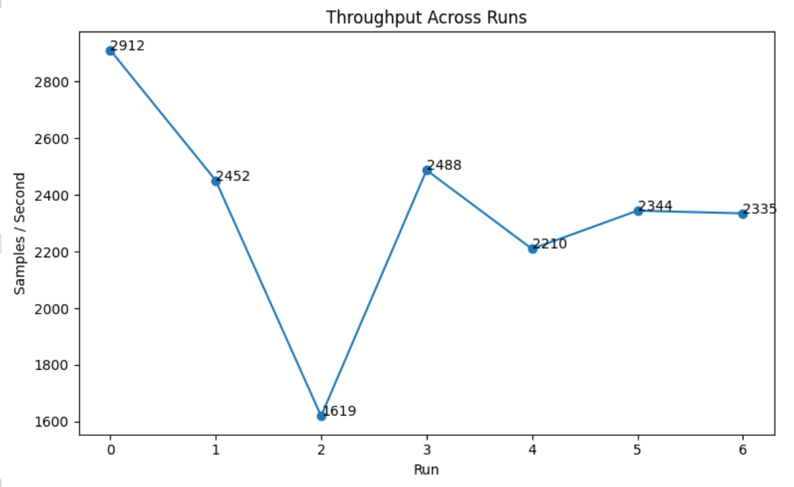
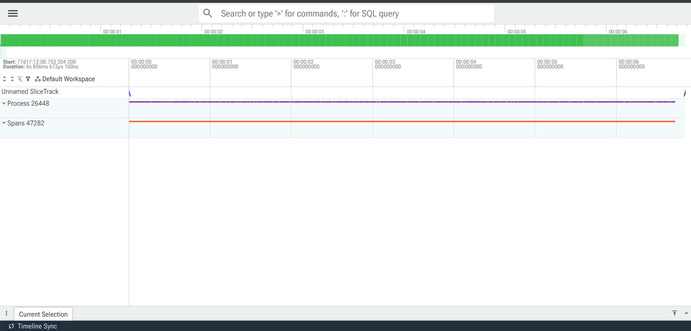

# ML Performance Profiler

A lightweight PyTorch benchmarking and profiling toolkit for analyzing neural network performance.

## Features

* PyTorch Profiler integration
* CPU execution profiling
* Chrome trace export
* Memory utilization monitoring
* Throughput benchmarking
* CSV report generation
* Performance visualization

## Project Structure

```text
ML-Performance-Profiler/
├── benchmark.py
├── metrics.py
├── throughput.py
├── report.py
├── visualize.py
├── reports/
│   ├── results.csv
│   └── throughput.png
├── traces/
│   └── trace.json
└── requirements.txt
```

## Installation

```bash
pip install -r requirements.txt
```

## Run Benchmark

```bash
python benchmark.py
```

Example Output

```text
Elapsed Time: 8.32s
Throughput: 3077.28 samples/sec
Memory Usage: 368.97 MB
Trace saved to traces/trace.json
```

## Generate Visualization

```bash
python visualize.py
```

Output:

```text
reports/
├── results.csv
└── throughput.png
```

## Metrics Collected

| Metric          | Description                           |
| --------------- | ------------------------------------- |
| CPU Time        | Operator-level execution time         |
| Memory Usage    | Process memory consumption            |
| Throughput      | Samples processed per second          |
| Execution Trace | Chrome trace for performance analysis |

## Technologies

* Python
* PyTorch
* Pandas
* Matplotlib
* psutil

## Future Improvements

* GPU profiling support
* Multi-model benchmarking
* Interactive dashboard
* Distributed training analysis
* Automated optimization suggestions

## Benchmark Results

<div align="center">

</div>

## Execution Trace Analysis

PyTorch execution trace visualized using Perfetto.

<div align="center">

</div>
